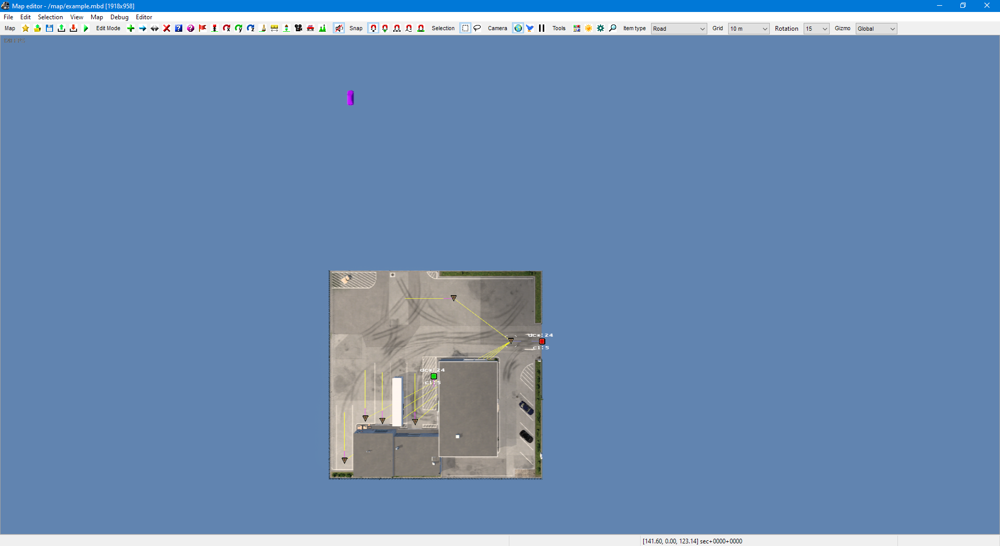
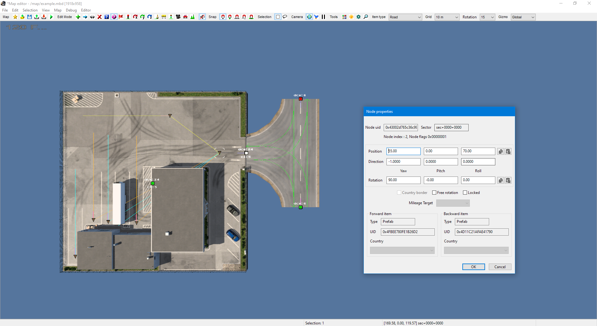
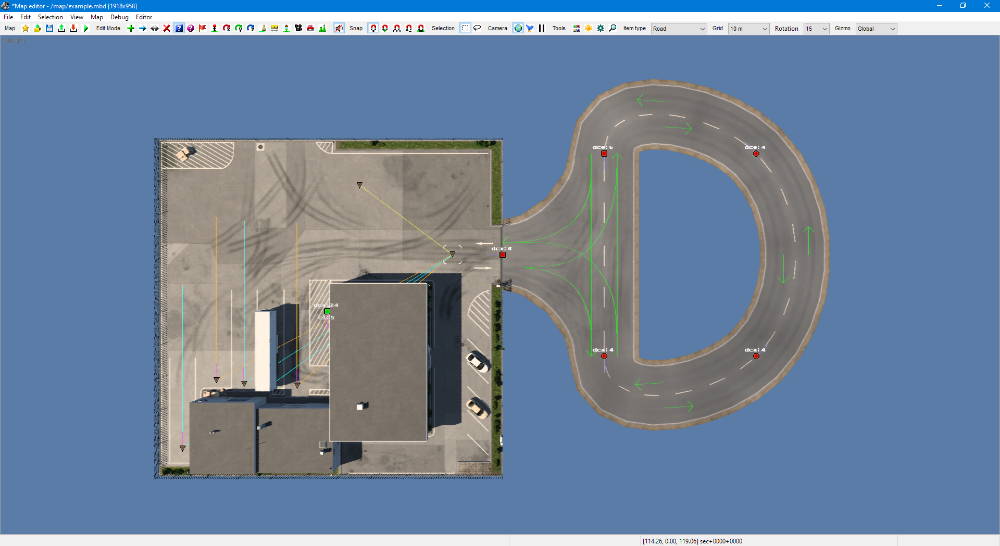

# Sample #2: Prefabs
In this sample, we will take a look at how to add prefabs to a map. You can find the full source code at `Samples/02-Prefabs/Program.cs`.

## Instantiating the map
As before, we'll start with an empty map:

```cs
using TruckLib.ScsMap;

var map = new Map("example");
```

## Extracting game assets
To be able to place a prefab, its control node positions and spawn points must be to known to the library,
so the prefab descriptor (`.ppd`) file of the prefab model must be opened first. In this sample, we're going to
fetch it directly from `base.scs` using the `HashFsReader` class:

```cs
using TruckLib.HashFs;

// (modify this path before running)
var gameRoot = @"E:\SteamLibrary\steamapps\common\Euro Truck Simulator 2";
var baseScs = HashFsReader.Open(Path.Combine(gameRoot, "base.scs"));
```

Note that the game must be closed for this because it locks the file.

## Placing a prefab
Let's now place a company prefab. The first step is to load the prefab descriptor:
```cs
using TruckLib.Models.Ppd;

var companyDescriptor = PrefabDescriptor.Open("/prefab2/car_dealer/car_dealer_01_fr.ppd", baseScs);
```

With this, we can call the `Prefab.Add` method, which will add a prefab to the map.
(This sample, like the first, uses hardcoded coordinates.)

```cs
var company = Prefab.Add(map,
    // position of node 0
    new Vector3(55, 0, 70),
    // Unit name
    "dlc_fr_14",
    // .ppd
    companyDescriptor,
    // rotation (90° in this case)
    Quaternion.CreateFromYawPitchRoll(1.5708f, 0, 0));
company.Variant = "bhv_fr";
company.Look = "green_fr";
```

The map now contains a `car_dealer_01_fr` prefab whose control node 0 is at
(55, 0, 70) and which is rotated the same way as it would be if you set the
rotation of said node to this value in the editor.

The library has also automatically created the necessary `Company` slave item.

Here's our progress so far:



## Attaching prefabs
Next, we will place a T junction and attach it to the entrance of the company. As above, we will again extract the `.ppd` file:

```cs
var crossingDescriptor = PrefabDescriptor.Open("/prefab2/cross_temp/fr/fr_r1_x_r1_t_narrow_tmpl.ppd", baseScs);
```

We can now add the junction to the map:

```cs
var crossing = Prefab.Add(map, company.Nodes[0].Position, "387", 
    crossingDescriptor, Quaternion.CreateFromYawPitchRoll(-1.5708f, 0, 0));
crossing.Variant = "shoul_fr_1";
crossing.Look = "gray_fr";
crossing.AdditionalParts.Add("_midlines");
```

You will have noticed that we're placing the 0th control node of this prefab at the same coordinate
as that of the company &ndash; this is because said node of the T junction is the stem, and therefore
the arm we want to attach. We also set the rotation to -90° so that these two prefabs line up.

We now have our two prefabs in the map and want to attach them. In this particular case, there's one
additional step we need to take. Both of the nodes we wish to connect are node 0 of the prefab,
and therefore the origin. Since two origin nodes can't be connected, we will change the origin of the
junction:

```cs
crossing.ChangeOrigin(1);
```

Now, the two prefabs can be connected:

```cs
company.Attach(crossing);
```

In this case, we're using the "lazy" version of the `Attach` method which finds the closest two nodes
of the two prefabs and merges them into one. In other scenarios, you will need to specify which nodes you
would like to merge.

Our map now looks like this:



## Appending and attaching road
As a final step, we will take a look at how prefabs and polyline items can be connected.

Something you can do is to grow a road out of a prefab node:
```cs
var road = crossing.AppendRoad(1, new Vector3(100, 0, 88), "template22");
road.Right.Variant = "broken";
road.Right.LeftEdge = "fr_sh_15";
road.Right.RightEdge = "fr_sh_15";
road = road.Append(new Vector3(100, 0, 52)).Append(crossing.Nodes[0].Position);
```

One node of the prefab is still unconnected, so let's attach our road back to it:

```cs
crossing.Attach(road);
```

This is once again the "lazy" method which merges the closest two nodes.

## Saving the map
This concludes the second sample. The following code will place the map in the `user_map` directory
(if you're not on Windows, this will probably need to be adjusted):

```cs
var documents = Environment.GetFolderPath(Environment.SpecialFolder.MyDocuments);
var userMap = Path.Combine(documents, "Euro Truck Simulator 2/mod/user_map/map/");
map.Save(userMap, true);
```

There should now be an `example.mbd` and an `example` directory in `mod/user_map/map` and 
you should be able to load the map in the editor.

Remember to **recompute the map** (Map > Recompute map). This is necessary because TruckLib
does not calculate the bounding boxes of items.

Here's our final result:



## Further reading
* [Working with prefabs](~/docs/TruckLib.ScsMap/prefabs.md)
* [Reading HashFS (.scs) archives](~/docs/TruckLib.HashFs/hashfs.md)