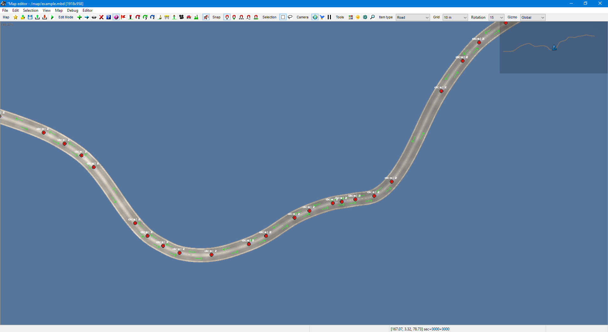

# Sample #3: Real world data

This sample demonstrates one possible approach for importing the course of a real road into a map for the purpose
of 1:1 mapping; in particular, it deals with the essential steps of fetching elevation data and projecting the points.
You can find the full source code at `Samples/02-RealRoad/Program.cs`.

## Structs
For convenience, we define the structs `GeographicCoordinate` and `ProjectedCoordinate`.

## Loading the data


Where you actually get the data from is out of scope for this sample, so I've provided a CSV file containing
WGS84 latitude/longitude coordinates describing the course of a road in Germany (© OpenStreetMap contributors).

```cs
var coordinates = LoadCoordinates();
```

We'll skip over `LoadCoordinates` here &ndash; it just loads the CSV file into a list of `GeographicCoordinate`s.

## Elevation
The majority of map data you will encounter will not have elevation data present, so we must fetch it ourselves. In this case,
we will use the [DEM.Net](https://github.com/dem-net/DEM.Net) library, which has a simple interface for getting the elevation of
points from several freely available elevation models.

DEM.Net uses the `Microsoft.Extensions.DependencyInjection` package, so to get an instance of the `ElevationService` class we need,
we will create a class `ElevationProvider` whose constructor takes one as an argument and a static method which requests an instance
of this class to be created:

```cs
using DEM.Net.Core;
using Microsoft.Extensions.DependencyInjection;

namespace RealRoad
{
    internal class ElevationProvider
    {
        private readonly ElevationService elevationService;
        private readonly DEMDataSet dataset = DEMDataSet.SRTM_GL1;

        public static ElevationProvider Create()
        {
            var serviceCollection = new ServiceCollection();
            serviceCollection.AddDemNetCore();
            serviceCollection.AddTransient<ElevationProvider>();
            var services = serviceCollection.BuildServiceProvider();
            return services.GetService<ElevationProvider>();
        }

        public ElevationProvider(ElevationService elevationService)
        {
            this.elevationService = elevationService;
        }
}
```

We now add a method to this class which takes in the coordinates we just loaded and fetches the elevation of the road.

```cs
public List<GeographicCoordinate> GetElevations(List<GeographicCoordinate> points)
{
    elevationService.DownloadMissingFiles(dataset, GetBoundingBoxContainingPoints(points));

    var geoPoints = elevationService.GetLineGeometryElevation(
        points.Select(p => new GeoPoint(p.Latitude, p.Longitude)), 
        dataset).ToList();
    return geoPoints.Select(
        x => new GeographicCoordinate(x.Latitude, x.Longitude, x.Elevation ?? 0))
        .ToList();
}
```

This gives us a new set of coordinates which not only has elevation for our input coordinates, but 
also accounts for all elevation changes along the way.

Finally, we'll call it from Main:

```cs
var elevationProvider = ElevationProvider.Create();
var coordinatesWithElevation = elevationProvider.GetElevations(coordinates);
```

The first time you run this program, this step will take several seconds
as DEM.Net needs to download the elevation model for the requested region; on any subsequent run, it will load a cached version from disk.

## Projection
The real world is round, but game worlds are flat, so we need to project our points into that flat world. Here, we will use a transverse Mercator;
more specifically, UTM zone 32N, which is the UTM zone most of Germany falls into. The library
[DotSpatial.Projections](https://www.nuget.org/packages/DotSpatial.Projections) will do this for us.

The method for projecting our list of coordinates looks like this:

```cs
using DotSpatial.Projections;

static List<ProjectedCoordinate> Project(IList<GeographicCoordinate> coordinates, 
    ProjectionInfo source, ProjectionInfo dest)
{
    // Convert our list into the flat array expected by the library
    var xy = new double[coordinates.Count * 2];
    for (int i = 0; i < coordinates.Count; i++)
    {
        xy[i * 2] = coordinates[i].Longitude;
        xy[(i * 2) + 1] = coordinates[i].Latitude;
    }

    // Project the points in-place
    Reproject.ReprojectPoints(xy, null, source, dest, 0, coordinates.Count);

    // And convert it back into a list of ProjectedCoordinates
    var points = new List<ProjectedCoordinate>(coordinates.Count);
    for (int i = 0; i < coordinates.Count; i++)
    {
        var easting = xy[i * 2];
        var northing = xy[(i * 2) + 1];
        points.Add(new ProjectedCoordinate(easting, northing, coordinates[i].Height));
    }
    return points;
}
```

And this is how we call it:

```cs
var sourceCrs = KnownCoordinateSystems.Geographic.World.WGS1984;
var destCrs = KnownCoordinateSystems.Projected.UtmWgs1984.WGS1984UTMZone32N;
var points = Project(coordinatesWithElevation, sourceCrs, destCrs);
```

We now have a list of `ProjectedCoordinate`s. Let's also define a center point for our map, which we will subtract
from our projected coordinates later:

```cs
var center = Project(new[] { new GeographicCoordinate(54.744101, 9.799639) },
    sourceCrs, destCrs)[0];
```

One last thing &ndash; the game has a minimum length for road segments, which in this case is 1.25 m.
Further, segments shorter than 5 m often render quite strangely. Now that we have our projected points
and know how long each segment will be in-game, we'll filter out these segments.
(This sample has enough LOC as it is, so for the sake of simplicity, we just remove any point for which
|| n<sub>i</sub> - n<sub>i-1</sub> || < 5.)

```cs
points = RemoveShortSegments(points);
```

## Adding the road to the map
We now have everything we need to add the road to a map. For this step, I will assume that you have read
[Sample #1: Simple example](~/docs/Samples/00-simple.md).

As with the previous samples, we'll create an empty map:

```cs
using TruckLib.ScsMap;

var map = new Map("example");
```

The road items can be created as follows:

```cs
var road = Road.Add(map,
    PointToNodePosition(points[0], center),
    PointToNodePosition(points[1], center),
    "ger1");

for (int i = 2; i < points.Count; i++)
{
    road = road.Append(PointToNodePosition(points[i], center));
}
```

(The method `PointToNodePosition` simply subtracts the center point and inverts the Z coordinate.)

The first road item needs to be explicitly created with the first and second point of the road. After this,
you can call `Append` in a loop with the remaining points. Remember that a road item can only be appended to once, so
make sure to assign the return value of `Append`, which is the newly created road item, back to `road`.

## Saving the map
You know the drill by now:

```cs
var documents = Environment.GetFolderPath(Environment.SpecialFolder.MyDocuments);
var userMap = Path.Combine(documents, "Euro Truck Simulator 2/mod/user_map/map/");
map.Save(userMap, true);
```

Remember to **recompute the map** (Map > Recompute map). This is necessary because TruckLib
does not calculate the bounding boxes of items.

This is what you should see:



## Further reading
* [Sample #1: Simple example](~/docs/Samples/00-simple.md)
* [Working with polyline items](~/docs/TruckLib.ScsMap/polyline-items.md)
